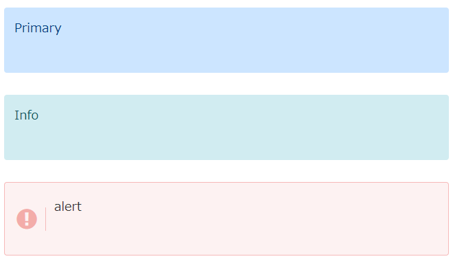

# wp-post

This project was born inspired by the vscode extension [[WordPress Post](https://marketplace.visualstudio.com/items?itemName=masa86.wordpress-post)] and [Scratchpad's article](https://scratchpad.jp/modify-wordpress-post-1/).

You can run a script or command to post your markdown files to wordpress.

In addition, we have prepared a function to detect broken links of image files in Markdown and images not used in Markdown in the folder where Markdown is placed.

>I'm sorry, but when I updated to version 1.0.0, I refactored the method name. Mainly, we received information that there was confusion during implementation because there was no "Async" suffix even though it was an "asynchronous method", so we fixed it. If you are using an earlier version, updating may cause compilation errors.

# Installing
## Package manager
Using npm:
```
$ npm install wp-post
```

# Example

## Usage


Like `WordPress Post`, write the article title and publication status in the "Frontmatter" part as shown below.


~~~md
---
title: post'title
status: draft
---

# title
test

<p>test1</p>

```java
public class Hoge{
}
```

~~~

The following is the folder and file structure.
```
post01
├── images
│   └── test-b.png
├── post01.md
└── post01.png
```
>Similarly, if "slug" is not specified, the file name will be slug.


### wppostAync
Convert the markdown file to HTML and post it to WordPress.
```js
import { wppostAync } from "wp-post";

const docPath = "./post01/post01.md";

const apiUrl = "apiUrl"; // e.g https://example.com/wp-json/wp/v2
const authUser = "authUser";// e.g userName,mail
const authPassword = "authPassword";// e.g "xxxs xxxs xxxs xxxs xxxs xxxx"

//
const postId = await wppostAync(docPath, apiUrl, authUser, authPassword);
console.log(postId): // post id
```

### getLinksAsync , getFileReferencesAsync
`getLinksAsync` detects the link status of images in the markdown, 
`getFileReferencesAsync` detects the link status of image files in the folder where the markdown is located.
```js
import { getLinksAsync, getFileReferencesAsync } from "wp-post";

const docPath = "./post01/post01.md";
const results1 = await getLinksAsync(docPath);
console.log(results1): //  images that cannot be referenced in markdown.

const results2 = await getFileReferencesAsync(docPath);
console.log(results2): // A list of the referencing status of files.
```
>`getFileReferencesAsync`
The default file extensions to be targeted are ".png", ".jpg", and ".gif". They can be specified as a string array in the first argument, for example, [" .png", ".jpg", ".gif"].


### class files
The above process is defined in the following class: `WPPost` . It can also be used.
#### WPPost

When using `wppostAync()` 
```js
import WPPost from "wp-post";
const wpost = new WPPost(docPath);

// If you want to change the config.
// Set up automatic conversion to a link card.
wpost.getConfig().useLinkCardHtmlGenerator = true; // default: false

// change APIUrl
// https://example.com/wp-json/wp/v2/posts -> https://example.com/wp-json/wp/v2/myposts
wpost.getConfig().apiPostUrl = "myposts"; // default: posts

// https://example.com/wp-json/wp/v2/media -> https://example.com/wp-json/wp/v2/mymedia
wpost.getConfig().apiMediaUrl = "mymedia";// default: media


//
const apiUrl = "https://example.com/wp-json/wp/v2";
const authUser = "userName or email";
const authPassword = "xxxs xxxs xxxs xxxs xxxs xxxx";
//
const postId = await wpost.postAsync(apiUrl, authUser, authPassword);
```

When using `getLinksAsync()` or `getFileReferencesAsync()`  .

```js
const wpost = new WPPost(docPath);

const results1 = await wpost.getLinksAsync();
const results2 = await wpost.getFileReferencesAsync();
```
##### Advanced usage
* change template
Below we introduce the conversion of Markdown statements such as ```(code) and :::(container). Some of them can be customized in this version.

Here's an example using the `detail` template.
Placeholders are described with {{}}.

In the case of detail, the *label* value is embedded, so write {{label}} in the target location.

```js
const wpost = new WPPost(docPath);
wpost.template.tplDetail= new Template(`<details><summary>!!{{label}}!!aaa</summary>`,`</details>`);
```
>Specify the first argument of the Template class as the opening tag and the second argument as the closing tag.


Or you can override the tag generation logic itself to do your own thing.
Here is a sample combined with the previous template. See this specification here [markdown-it-container](https://www.npmjs.com/package/markdown-it-container).
```js
  const wpost = new WPPost(docPath);

  wpost.template.detail= (
    tokens: any, idx: any
  ) :string=>{

    var m = tokens[idx].info.trim().match(/^detail\s+(.*)$/);

    let label = "";
    if (Array.isArray(m) && m.length >= 2)
      label = MarkdownIt().utils.escapeHtml(m[1]);

    if (tokens[idx].nesting === 1) {
      return wpost.template.tplDetail.renderStart({ label: label });
    } else {
      return wpost.template.tplDetail.renderEnd();
    }

  }
```


Here are the embedded keys and values ​​provided by each template.
* detail
  |  key  |  value  |
  | ---- | ---- |
  |  *label*  |  summary' value  |
  
  default
  ```js
   public tplDetail: Template = new Template(
    `<details ><summary>{{label}}</summary>`,
    `</details>`
  );
  ```

* detailOpen
  |  key  |  value  |
  | ---- | ---- |
  |  *label*  |  summary' value  |
  
  default
  ```js
    public tplDetailOpen: Template = new Template(
    `<details  open="true"><summary>{{label}}</summary>`,
    `</details>`
  );
  ```
* note
  |  key  |  value  |
  | ---- | ---- |
  |  *type*  |   type: `primary` `info` `alert`  <br /> *wordpress cocoon'setting.*|
  
  default
  ```js
    public tplNote: Template = new Template(
    `<div class="note {{type}}"><div class="note-body">`,
    `</div></div>`
  );
  ```
* sticky
  |  key  |  value  |
  | ---- | ---- |
  |  *type*  |   type: `st-red` `st-blue` `st-yellow` `st-green`  <br /> *wordpress cocoon'setting.*|
  
  default
  ```js
    public tplSticky: Template = new Template(
    `<div class="wp-block-cocoon-blocks-sticky-box blank-box block-box sticky {{type}}">`,
    `</div>`
  );
  ```
* label
  |  key  |  value  |
  | ---- | ---- |
  |  *title*  |   title string |
  
  default
  ```js
    public tplLabel: Template = new Template(
    `<div class="wp-block-cocoon-blocks-label-box-1 label-box block-box"><div class="label-box-label block-box-label box-label"><span class="label-box-label-text block-box-label-text box-label-text">{{title}}</span></div><div class="label-box-content block-box-content box-content">`,
    `</div></div>`
  );
  ```
* speech
  |  key  |  value  |
  | ---- | ---- |
  |  *name*  |   Name displayed under Avatar |
  |  *image*  |   Avatar image<br/>Specify a file location that the img tag can access |
  |  *position*  |   `sbp-r`<br />If you specify "opposite": true and display it on the right side, the string `sbp-r` will be entered. This string is from wordpress cocoon style. It will be possible to change these strings in the next and subsequent versions. |
  
  default
  ```js
    public tplSpeech: Template = new Template(
    `<div class="wp-block-cocoon-blocks-balloon-ex-box-1 speech-wrap sb-id-1 sbs-stn {{position}} sbis-cb cf block-box">
        <div class="speech-person">
        <figure class="speech-icon">
        
        </figure>
        <div class="speech-name">{{name}}</div>
        </div>
        <div class="speech-balloon">`,
    `</div></div>`
  );
  ```
* linkCard
  |  key  |  value  |
  | ---- | ---- |
  |  *url*  |   link href value |
  |  *title*  |   og title |
  |  *image*  |   og image |
  |  *description*  |   og description |
  |  *domain*  |   domain from url |
  
  default
  ```js
  public tplLinkCard: Template = new Template(
      `<a href="{{url}}" title="{{title}}" class="blogcard-wrap internal-blogcard-wrap a-wrap cf">
            <div class="blogcard internal-blogcard ib-left cf">
              <div class="blogcard-label internal-blogcard-label">
                <span class="fa"></span>
              </div>
              <figure class="blogcard-thumbnail internal-blogcard-thumbnail">
                
              </figure>
              <div class="blogcard-content internal-blogcard-content">
                <div class="blogcard-title internal-blogcard-title">
                {{title}}
                </div>
                <div class="blogcard-snippet internal-blogcard-snippet">
                {{description}}
                </div>
              </div>
              <div class="blogcard-footer internal-blogcard-footer cf">
                <div class="blogcard-site internal-blogcard-site">
                  <div class="blogcard-favicon internal-blogcard-favicon">
                    
                  </div>
                  <div class="blogcard-domain internal-blogcard-domain">
                  {{domain}}
                  </div>
                </div>
              </div>
            </div>
          </a>`
    );
    ```


* code
  The code specifies the conversion process itself as a function.


  This is simply a way to specify a fixed string.
  You can freely convert code tags (and their parent pre tags) to refer to the default implementation.
  ```js
    wpost.template.code =  (
      _ch: cheerio.CheerioAPI,
      _code: cheerio.Element,
      _useLineNumbers: boolean
    ): string => {
      // 
      return `<code>abcde</code>`;
    };
  ```

  default
    ```js
    this.code = (
        ch: cheerio.CheerioAPI,
        code: cheerio.Element,
        useLineNumbers: boolean
      ): string => {
        // 
        let className = ch(code).attr("class");
        let text = ch(code).text();
        let parent = ch(code).parent();
        let parent_tagName = parent.get(0)?.tagName.toLowerCase();
        //
        if (className == null) className = "";
        //
        let languages = className
          .replace("language-", "")
          .replace("diff-", "")
          .replace("diff_", "")
          .trim()
          .split(":");
        //
        let language = languages.length >= 1 ? languages[0] : null;
        let filePath = languages.length >= 2 ? languages[1] : null;

        if (parent_tagName === "pre") {
          // prism
          if (!!language) ch(parent).attr("data-label", filePath);
          //
          if (!!language) ch(parent).attr("data-lang", language);
          if (!!filePath) ch(parent).attr("data-file", filePath);
        }

        if (className.startsWith("language-mermaid")) {
          // WP mermaid
          className = "mermaid";
        } else if (className.startsWith("language-diff")) {
          // diff
          className = "language-diff";
          className += " diff-highlight";
          // linenumbers
          if (useLineNumbers) className += " line-numbers";
        } else {
          className = `language-${language}`;
          // linenumbers
          if (useLineNumbers) className += " line-numbers";
        }

        //
        return `<code class="${className}">${MarkdownIt().utils.escapeHtml(
          text
        )}</code>`;
      };
    ```

Like markdown-it, it can be extended with .use(plugin,...params).
```js
const wpost = new WPPost(docPath);

wpost.use(require("<plugin"))
```

## Command Line
### wppost
Convert the markdown file to HTML and post it to WordPress.

Execute the command as follows:
```
$ wppost filePath -a <apiUrl> -u <userName> -p "<password>"

complete:😀  2294

```

After *complete:😀*, the `POSTID` that was posted will be displayed.

It is also possible to save it in the setting file and only specify the markdown file.
The setting method is described below.
#### config
```
$ wppost config
```
Sets information interactively using Wordpress's REST API.
```
? What is your apiUrl? https://<apiUrl>
? What is your authUser ? authUser
? What is your authPassword ? xxx xxx xxx xxx xxx xxx
? What is your wp-api of Post(ex.'posts') ? (posts)
? What is your wp-api of Media(ex.'media') ? (media)
? Automatically convert a-tags into link cards? ? (y/N)

? Do you want to save these changes? Yes
Here are the changes you made:
apiUrl: https://<apiUrl>
authUser: authUser
authPassword: xxx xxx xxx xxx xxx xxx
apiPostUrl: posts
apiMediaUrl: media
automaticallyLinkCard: false

Configuration saved to C:\Users\user\AppData\Roaming\.wppost\config.json
```
After that, you will be able to post just by specifying the markdown file.
```
$ wppost ./post01/post01.md 
complete:😀  2294
```


You can check the settings with `wppost config -s` or `wppost config --show` .
```
$ wppost config -s
Config file path: C:\Users\user\AppData\Roaming\.wppost\config.json
apiUrl: https://<apiUrl>
authUser: authUser
authPassword: xxx xxx xxx xxx xxx xxx
```

You can delete the settings with `wppost config -d` or `wppost  config --delete` .
```
$ wppost  config --delete
? Are you sure you want to delete the current configuration? Yes
Configuration deleted.

$ wppost config -s
Configuration is not exists.
```

#### option
For option setting, give json as a string to -o or --option. json is single line and don't forget to enclose the elements in double quotes.

Below are the settings to generate line numbers and link cards.
```
$ wppost filePath -a <apiUrl> -u <userName> -p "<password>" -o "{\"useLineNumbers\":true,\"useLinkCard\":true }"
```


### checker

Detects broken links in image files in markdown, or images that are not used in markdown and are in the folder where markdown files are placed. Just add the `-c` or `--check` option.
Execute the command as follows:
```
$ wppost filePath -c
```

The following is the folder and file structure.
```
sample
├── images
│   ├── test-a.png
│   ├── test-b.png
│   └── test01.png
├── sample.md
└── sample.png
```
The markdown file is written as follows:

./sample/sample.md
~~~md
# sample!


~~~


result:
```
$ wppost ./sample/sample.md -c
target:
./sample/sample.md
dir:
./sample

📄 markdown :🌱 2 ⚠️ 1 📥 workspace : 🌱 2 ⚠️ 2

📄 markdown
 🌱 sample\sample.png
 🌱 sample\images\test01.png
 ⚠️ sample\images\test02.png
📥 workspace
 ⚠️ sample\images\test-a.png
 ⚠️ sample\images\test-b.png
 🌱 sample\images\test01.png
 🌱 sample\sample.png
```
🌱 will be displayed for paths that exist correctly, 
and ⚠️ will be displayed for paths that do not exist or are not referenced.


# Markdown

In addition to general markdown descriptions, the following are extended.


>the current version sets the css class name according to the wordpress template: [cocoon](https://wp-cocoon.com/) style, but we plan to make it customizable in a later version upgrade.

* code
  >*line-numbers* is inserted below, but by default it is not inserted and line numbers are not displayed.

  * plane
    ~~~md
    ```
    $ cd ../
    ```
    ~~~

      generated html.

    ```html
    <pre>
      <code class="language- line-numbers">$ cd ../
    </code>
    </pre>
    ```
      like this.
    


  * language

    ~~~md
    ```java
    public class HogeClass{
    }
    ```
    ~~~

      generated html.

    ```html
    <pre data-lang="java">
      <code class="language-java line-numbers">public class HogeClass{
    }
    </code>
    </pre>
    ```
      like this.
    

  * language with filepath

    ~~~md
    ```java:HogeClass.java
    public class HogeClass{

    }
    ```
    ~~~
    
      generated html.
    ```html
    <pre data-label="Java.java" data-lang="java" data-file="HogeClass.java">
      <code class="language-java line-numbers">public class Hoge{

    }
    </code></pre>
    ```
      like this.
    

* uml
    * mermaid
      Requires [WP Mermaid](https://ja.wordpress.org/plugins/wp-mermaid/) to be added to the plugin.
      ~~~md
      ```mermaid
      graph TD;
          A-->B;
          A-->C;
          B-->D;
          C-->D;
      ```
      ~~~
      generated html.
      ```html
      <pre data-lang="mermaid">
        <code class="mermaid">graph TD;
          A--&gt;B;
          A--&gt;C;
          B--&gt;D;
          C--&gt;D;
      </code>
      </pre>
      ```

      like this.
      

      ~~~md
      ```mermaid
      sequenceDiagram
          Alice->>John: Hello John, how are you?
          John-->>Alice: Great!
      ```
      ~~~
      generated html.
      ```html
      <pre data-lang="mermaid">
        <code class="mermaid">sequenceDiagram
          Alice-&gt;&gt;John: Hello John, how are you?
          John--&gt;&gt;Alice: Great!
      </code>
      </pre>
      ```
      like this.
      

* container
   
  * detail
    ```md
    ::: detail test1 
    here be dragons
    :::
    ```
    generated html.
    ```html
    <details><summary>test1</summary>
    <p><em>here be dragons</em></p>
    </details>
    ```

    like this.
    

    > If you want the open state to be the initial state, specify `detail-open`


  * note
    ```md
    ::: note primary
    Primary
    :::

    ::: note info
    Info
    :::

    ::: note alert
    alert
    :::
    ```

    generated html.
    ```html
    <div class="note primary">
      <div class="note-body"><p>Primary</p></div>
    </div>
    <div class="note info">
      <div class="note-body"><p>Info</p></div>
    </div>
    <div class="note alert">
      <div class="note-body"><p>alert</p></div>
    </div>
    ```

    like this.
    
  * sticky
    ```md
    ::: sticky st-blue
    content
    :::
    ```

    generated html.
    ```html
    <div class="wp-block-cocoon-blocks-sticky-box blank-box block-box sticky st-blue">
      <p>sticky</p>
    </div>
    ```
    like this.
    
  * label
    ```md
    ::: label title
    content
    :::
    ```

    generated html.
    ```html
    <div class="wp-block-cocoon-blocks-label-box-1 label-box block-box">
      <div class="label-box-label block-box-label box-label">
        <span class="label-box-label-text block-box-label-text box-label-text">title</span>
      </div>
      <div class="label-box-content block-box-content box-content">
      <p>content</p>
      </div>
    </div>
    ```

    like this.
    
  * speech
      ```md
      ::: speech {"image":"<imagePath>","name":"<name>"}
      talk content A.
      :::


      ::: speech {"image":"<imagePath>","name":"<name>","opposite":true}
      talk content B.
      :::
      ```
      generated html.
      ```html
      <div class="wp-block-cocoon-blocks-balloon-ex-box-1 speech-wrap sb-id-1 sbs-stn sbp-l sbis-cb cf block-box">
        <div class="speech-person">
          <figure class="speech-icon">" alt="<name>" class="speech-icon-image"></figure>
          <div class="speech-name"><name></div>
        </div>
        <div class="speech-balloon">
          <p>talk content A.</p>
        </div>
      </div>
      <div class="wp-block-cocoon-blocks-balloon-ex-box-1 speech-wrap sb-id-1 sbs-stn sbp-r sbis-cb cf block-box">
        <div class="speech-person">
          <figure class="speech-icon">" alt="<name>" class="speech-icon-image"></figure>
          <div class="speech-name"><name></div>
        </div>
        <div class="speech-balloon">
          <p>talk content B.</p>
        </div>
      </div>
      ```

    like this.
      

* linkCard
  In the case of a link description with **blank line breaks before and after**, the html of the link card is generated.

    >By default, no link card is generated.
    Get the ogp tag of the link destination at the time of generation, and generate the link card with its contents.
    
    >In general, link cards are often created using javascript.
    (It will be developed as a wordpress plugin soon.)

    ```md
    link1
    [link2](https://hydro-cloud.com/helloworld) <!-- not works-->

    [link2](https://hydro-cloud.com/helloworld) <!--works-->

    ```

    ```html
    <p>link1 <a href="https://hydro-cloud.com/helloworld">link1</a></p>
    <p>
      <a href="https://hydro-cloud.com/helloworld" title="HelloWorld!" class="blogcard-wrap internal-blogcard-wrap a-wrap cf">
        <div class="blogcard internal-blogcard ib-left cf">
          <div class="blogcard-label internal-blogcard-label"> <span class="fa"></span> </div>
          <figure class="blogcard-thumbnail internal-blogcard-thumbnail">  </figure>
          <div class="blogcard-content internal-blogcard-content">
            <div class="blogcard-title internal-blogcard-title"> HelloWorld! </div>
            <div class="blogcard-snippet internal-blogcard-snippet"> プログラム初心者から環境構築の確認時まで幅広く使われる「HelloWorld」。C#,Java,PHP,Javascriptでの書き方をまとめてみました。Console.WriteLine(&amp;quot;HelloWorld!&amp;quot;); </div>
          </div>
          <div class="blogcard-footer internal-blogcard-footer cf">
            <div class="blogcard-site internal-blogcard-site">
              <div class="blogcard-favicon internal-blogcard-favicon">  </div>
              <div class="blogcard-domain internal-blogcard-domain"> https://hydro-cloud.com </div>
            </div>
          </div>
        </div>
      </a>
    </p>
    ```
    like this.
    


# Special Thanks
Thanks so much. Their great information was very helpful in development. And they helped me a lot.
* [WordPress Post](https://marketplace.visualstudio.com/items?itemName=masa86.wordpress-post)
* [メモ置場のブログ](https://scratchpad.jp/): Scratchpad'blog
