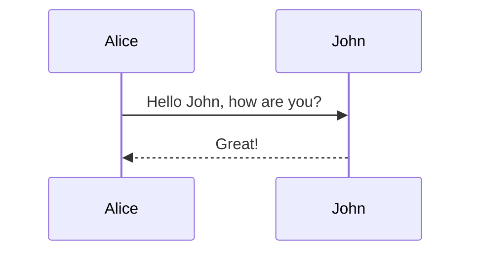

<p>test1</p>

# testHoge
## testHoge header2
|a|b|
|:-|-:|
|112312|2132131|

```java
public class Hoge{
}
```


```java:Java.java
public class Hoge{

}
```


<!--  -->

```java
public class Hoge{

}
```


```java:Java.java
public class Hoge{

}
```
==ハイライト==

+++ Click me!
H　==dden== text
+++

```js
 console.log('language javascript')
```
```vis
layout: bar
data: [
{ key: 0, value: 5 },
{ key: 1, value: 4 },
{ key: 2, value: 7 },
{ key: 3, value: 2 },
{ key: 4, value: 4 },
{ key: 5, value: 8 },
{ key: 6, value: 3 },
{ key: 7, value: 6 }
]
```


```html
<div id="app">
    <div id="actions">
    <button id="btnCopy">Copy To Clipboard</button>
    </div>
    <div id="content">
    <pre id="text"></pre>
    </div>
</div>
```

```css
body {
        background-color: rgba(0, 0, 0, 0.05);
        background-color: rgba(0, 0, 0, 0.05);
        height: 100%;
        margin: 0;
      }
```

::: detail test1 
*here be dragons*
:::


::: note primary
Primary
:::

::: note info
Info
:::

::: note alert
alert
:::


::: sticky st-blue
付箋風ボックス
:::


::: label ラベルボックスのタイトル
ラベルボックス
:::


::: speech {"image":"https://hydro-cloud.com/wp-content/themes/cocoon-master/images/man.png","name":"hoge"}
トーク内容A
:::


::: speech {"image":"https://hydro-cloud.com/wp-content/themes/cocoon-master/images/woman.png","name":"foo","opposite":true}
トーク内容B
:::




```plantuml
Bob -> Alice : hello
```
+++ Click me!
Hidden text


```rb
puts 'Hello, World'
```
+++


`hsla(100, 24%, 40%, 0.5)`

打ち消し線を使うには ~~ で囲みます。 ~~打ち消し~~


link1
[link1](https://hydro-cloud.com)

[link2](https://hydro-cloud.com/windows_sketch_aws-architectureicons)